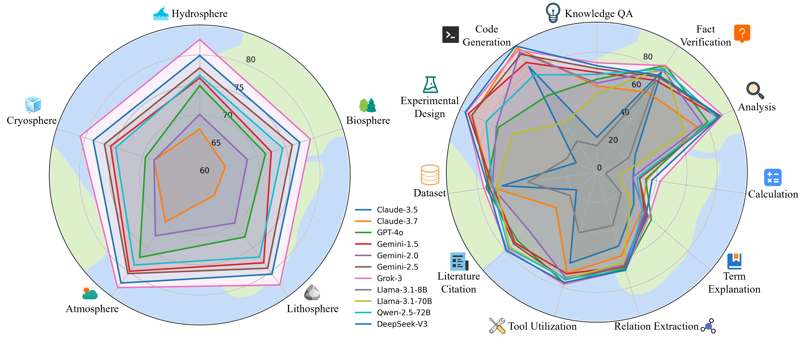
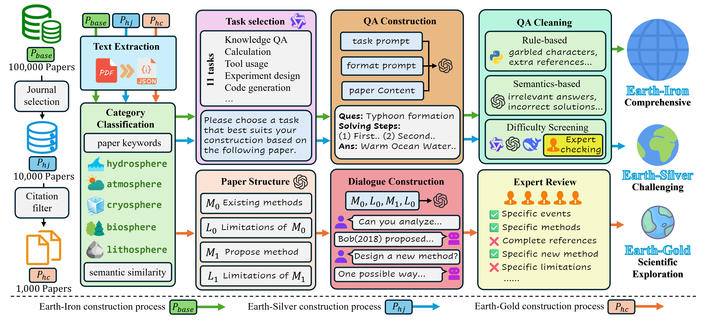

<div align="center">

# EarthSE: A Benchmark Evaluating Earth Scientific Exploration Capability for Large Language Models

<a href="https://arxiv.org/pdf/2505.17139"></a>

[\[🤗 HuggingFace\]](https://huggingface.co/ai-earth) 

</div>

---




## Abstract

Advancements in Large Language Models (LLMs) drive interest in scientific applications, necessitating specialized benchmarks such as Earth science. Existing benchmarks either present a general science focus devoid of Earth science specificity or cover isolated subdomains, lacking holistic evaluation. Furthermore, current benchmarks typically neglect the assessment of LLMs' capabilities in open-ended scientific exploration. In this paper, we present a comprehensive and professional benchmark for the Earth sciences, designed to evaluate the capabilities of LLMs in scientific exploration within this domain, spanning from fundamental to advanced levels. Leveraging a corpus of 100,000 research papers, we first construct two Question Answering (QA) datasets: **Earth-Iron**, which offers extensive question coverage for broad assessment, and **Earth-Silver**, which features a higher level of difficulty to evaluate professional depth. These datasets encompass five Earth spheres, 114 disciplines, and 11 task categories, assessing foundational knowledge crucial for scientific exploration. Most notably, we introduce **Earth-Gold** with new metrics, a dataset comprising open-ended multi-turn dialogues specifically designed to evaluate the advanced capabilities of LLMs in scientific exploration, including methodology induction, limitation analysis, and concept proposal. Extensive experiments reveal limitations in 11 leading LLMs across different domains and tasks, highlighting considerable room for improvement in their scientific exploration capabilities. The benchmark is available on [HuggingFace](https://huggingface.co/ai-earth).


---



## Method Overview

Automated construction of three-tiered benchmarks (Earth-Iron, Earth-Silver, Earth-Gold) from 100K papers, enabling comprehensive evaluation of knowledge coverage, professional proficiency, and scientific exploration capabilities.


---

## Evaluation

### Clone this repository
```bash
git clone https://github.com/black-yt/EarthSE.git
```

### Configure API key
```bash
export OPENAI_API_KEY="*****"
export OPENAI_BASE_URL="*****"
```

### Run the test script
```bash
cd evaluation
python Earth_Iron_Silver.py
python Earth_Gold.py
```